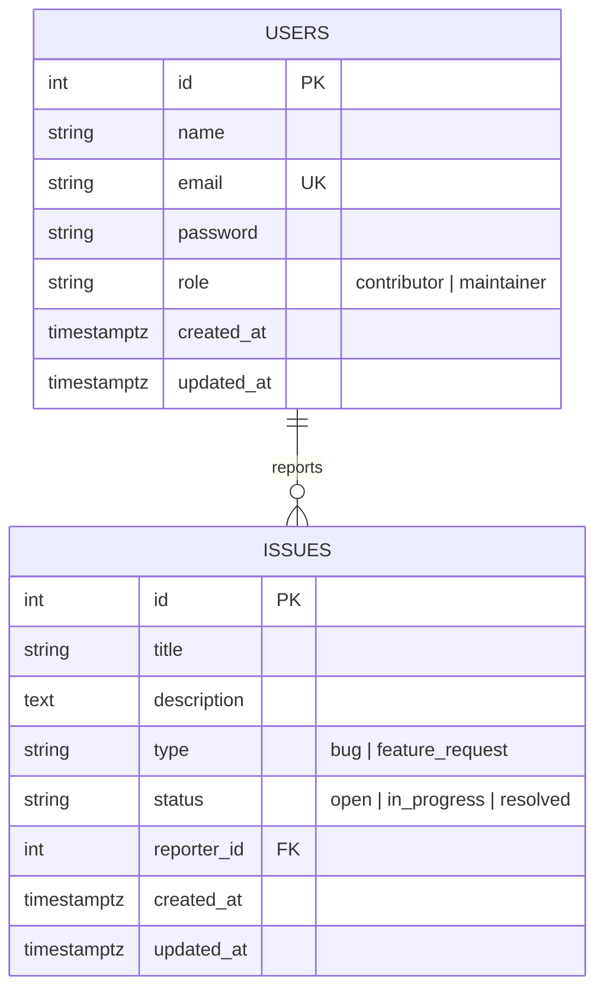

# 🌌 DevPulse API

DevPulse is a robust, production-ready RESTful backend API designed to track development issues, bugs, and feature requests. Built using **TypeScript, Node.js, Express, and PostgreSQL**, it features role-based access control, secure JWT-based authentication, query filtering, and automated schema generation.

---

## 🚀 Key Features

*   **🔒 Secure Authentication:** JWT token-based authentication with password hashing using `bcryptjs`.
*   **👥 Role-Based Access Control (RBAC):** Distinct permissions for `contributor` and `maintainer` roles.
*   **🐛 Issue Management:** Full CRUD operations for tracking bugs and feature requests.
*   **⚡ Performance Optimized:** SQL queries optimized using batch loading for reporter information (eliminating N+1 database queries).
*   **📊 Metrics Endpoint:** Exclusive analytical insights for maintainers showing issue status distribution and user role breakdown.
*   **🛠️ Developer-First Setup:** Automated database initialization, typescript compilation, and hot-reload development server.

---

## 🛠️ Technology Stack

| Component | Technology |
| :--- | :--- |
| **Runtime Environment** | Node.js |
| **Language** | TypeScript |
| **Web Framework** | Express (v5.2.1) |
| **Database** | PostgreSQL |
| **Query Driver** | `pg` (node-postgres) |
| **Authentication** | JSON Web Tokens (`jsonwebtoken`) & `bcryptjs` |
| **Config Management** | `dotenv` |

---

## 🗄️ Database Schema

The database is automatically initialized and migrated upon startup. It comprises two main tables:



### 1. `users`
*   `id`: `SERIAL` Primary Key
*   `name`: `VARCHAR(255)` (Required)
*   `email`: `VARCHAR(255)` (Required, Unique, Lowercase index)
*   `password`: `VARCHAR(255)` (Required, Hashed)
*   `role`: `VARCHAR(20)` (Default: `contributor`, Allowed values: `contributor`, `maintainer`)
*   `created_at` / `updated_at`: `TIMESTAMPTZ`

### 2. `issues`
*   `id`: `SERIAL` Primary Key
*   `title`: `VARCHAR(150)` (Required, Max 150 characters)
*   `description`: `TEXT` (Required, Min 20 characters)
*   `type`: `VARCHAR(20)` (Required, Allowed values: `bug`, `feature_request`)
*   `status`: `VARCHAR(20)` (Default: `open`, Allowed values: `open`, `in_progress`, `resolved`)
*   `reporter_id`: `INTEGER` (Foreign Key referencing `users(id)`)
*   `created_at` / `updated_at`: `TIMESTAMPTZ`

---

## 📁 Project Structure

The codebase is organized following clean-architecture principles:

```text
devpulse/
├── src/
│   ├── app.ts                 # Express app config (global middleware, health route, routes router)
│   ├── index.ts               # Server entry point & DB bootloader
│   ├── config/
│   │   ├── database.ts        # pg.Pool connection settings & configuration
│   │   └── schema.ts          # SQL schema DDL and table setup script
│   ├── controller/
│   │   ├── auth.controller.ts # Handlers for registration & login
│   │   └── issues.controller.ts # Handlers for issues CRUD & actions
│   ├── middleware/
│   │   ├── authMiddleware.ts  # JWT validation & Role Guards
│   │   └── errorHandler.ts    # Global centralized Express error handler
│   ├── router/
│   │   ├── auth.routes.ts     # Auth endpoints
│   │   ├── issues.routes.ts   # Issue endpoints
│   │   └── metrics.routes.ts  # Metrics analytical endpoint
│   ├── services/
│   │   ├── auth.service.ts    # Database access functions for Users
│   │   └── issues.service.ts  # Database access functions & Batching logic for Issues
│   ├── types/
│   │   └── index.ts           # Shared TypeScript interfaces & types
│   └── utils/
│       ├── jwt.ts             # JWT token helpers
│       ├── response.ts        # Standardized API response format utilities
│       └── validation.ts      # Request body structure validation functions
├── .env                       # Environment configuration variables
├── tsconfig.json              # TypeScript compilation config
└── package.json               # Dependencies and command scripts
```

---

## 🔌 API Documentation

### Base URL
All API paths are prefixed with `/api`. A `/health` route is also available at root level.

---

### 🔑 Authentication Endpoints

#### 1. Register User
*   **Endpoint:** `POST /api/auth/signup`
*   **Access:** Public
*   **Request Body:**
    ```json
    {
      "name": "Jane Doe",
      "email": "jane@example.com",
      "password": "securepassword",
      "role": "contributor" 
    }
    ```
    *(Note: `role` defaults to `contributor` if omitted. Allowed values: `contributor` or `maintainer`)*
*   **Response (201 Created):**
    ```json
    {
      "success": true,
      "message": "User registered successfully",
      "data": {
        "id": 1,
        "name": "Jane Doe",
        "email": "jane@example.com",
        "role": "contributor",
        "created_at": "2026-05-24T08:00:00.000Z",
        "updated_at": "2026-05-24T08:00:00.000Z"
      }
    }
    ```

#### 2. User Login
*   **Endpoint:** `POST /api/auth/login`
*   **Access:** Public
*   **Request Body:**
    ```json
    {
      "email": "jane@example.com",
      "password": "securepassword"
    }
    ```
*   **Response (200 OK):**
    ```json
    {
      "success": true,
      "message": "Login successful",
      "data": {
        "token": "eyJhbGciOiJIUzI1NiIsIn...",
        "user": {
          "id": 1,
          "name": "Jane Doe",
          "email": "jane@example.com",
          "role": "contributor",
          "created_at": "2026-05-24T08:00:00.000Z",
          "updated_at": "2026-05-24T08:00:00.000Z"
        }
      }
    }
    ```

---

### 🐛 Issue Tracker Endpoints

#### 1. Get All Issues
*   **Endpoint:** `GET /api/issues`
*   **Access:** Public
*   **Query Parameters (Optional):**
    *   `sort`: `newest` (default) or `oldest`
    *   `type`: Filter by type (`bug` or `feature_request`)
    *   `status`: Filter by status (`open`, `in_progress`, `resolved`)
*   **Response (200 OK):**
    ```json
    {
      "success": true,
      "data": [
        {
          "id": 5,
          "title": "Critical memory leak on request parsing",
          "description": "App memory usage rises continuously under high concurrency load.",
          "type": "bug",
          "status": "open",
          "created_at": "2026-05-24T12:00:00.000Z",
          "updated_at": "2026-05-24T12:00:00.000Z",
          "reporter": {
            "id": 1,
            "name": "Jane Doe",
            "role": "contributor"
          }
        }
      ]
    }
    ```

#### 2. Get Single Issue
*   **Endpoint:** `GET /api/issues/:id`
*   **Access:** Public
*   **Response (200 OK):**
    ```json
    {
      "success": true,
      "data": {
        "id": 5,
        "title": "Critical memory leak on request parsing",
        "description": "App memory usage rises continuously under high concurrency load.",
        "type": "bug",
        "status": "open",
        "created_at": "2026-05-24T12:00:00.000Z",
        "updated_at": "2026-05-24T12:00:00.000Z",
        "reporter": {
          "id": 1,
          "name": "Jane Doe",
          "role": "contributor"
        }
      }
    }
    ```

#### 3. Create Issue
*   **Endpoint:** `POST /api/issues`
*   **Access:** Authenticated (Requires `Authorization: <token>` header)
*   **Request Body:**
    ```json
    {
      "title": "Database connection pooling slow",
      "description": "Connection pool takes up to 2 seconds to recycle database connections.",
      "type": "bug"
    }
    ```
    *(Note: description must be at least 20 characters)*
*   **Response (210 Created):**
    ```json
    {
      "success": true,
      "message": "Issue created successfully",
      "data": {
        "id": 6,
        "title": "Database connection pooling slow",
        "description": "Connection pool takes up to 2 seconds to recycle database connections.",
        "type": "bug",
        "status": "open",
        "reporter_id": 1,
        "created_at": "2026-05-24T13:00:00.000Z",
        "updated_at": "2026-05-24T13:00:00.000Z"
      }
    }
    ```

#### 4. Update Issue
*   **Endpoint:** `PATCH /api/issues/:id`
*   **Access:** Authenticated
    *   **Contributors** can only update their *own* issues, and *only* if the status is `"open"`.
    *   **Maintainers** can update any issue at any time.
*   **Request Body:** (All fields are optional)
    ```json
    {
      "title": "Updated connection pooling issue",
      "description": "New updated description describing the exact database pooling issue details in depth.",
      "type": "feature_request"
    }
    ```
*   **Response (200 OK):**
    ```json
    {
      "success": true,
      "message": "Issue updated successfully",
      "data": {
        "id": 6,
        "title": "Updated connection pooling issue",
        "description": "New updated description describing the exact database pooling issue details in depth.",
        "type": "feature_request",
        "status": "open",
        "reporter_id": 1,
        "created_at": "2026-05-24T13:00:00.000Z",
        "updated_at": "2026-05-24T13:15:00.000Z"
      }
    }
    ```

#### 5. Update Issue Status
*   **Endpoint:** `PATCH /api/issues/:id/status`
*   **Access:** Authenticated (Requires **Maintainer** role)
*   **Request Body:**
    ```json
    {
      "status": "in_progress" 
    }
    ```
    *(Allowed values: `open`, `in_progress`, `resolved`)*
*   **Response (200 OK):**
    ```json
    {
      "success": true,
      "message": "Issue status updated successfully",
      "data": {
        "id": 6,
        "status": "in_progress"
        ...
      }
    }
    ```

#### 6. Delete Issue
*   **Endpoint:** `DELETE /api/issues/:id`
*   **Access:** Authenticated (Requires **Maintainer** role)
*   **Response (200 OK):**
    ```json
    {
      "success": true,
      "message": "Issue deleted successfully"
    }
    ```

---

### 📊 Metrics Endpoint

#### 1. Retrieve Statistics
*   **Endpoint:** `GET /api/metrics`
*   **Access:** Authenticated (Requires **Maintainer** role)
*   **Response (200 OK):**
    ```json
    {
      "success": true,
      "data": {
        "issues": {
          "total": 12,
          "by_status": {
            "open": 5,
            "in_progress": 4,
            "resolved": 3
          }
        },
        "users": {
          "total": 8,
          "by_role": {
            "contributor": 6,
            "maintainer": 2
          }
        }
      }
    }
    ```

---

## ⚙️ Environment Variables

Create a `.env` file in the root directory based on the following template:

```env
# Application Port
PORT=3000

# PostgreSQL Connection URL
DATABASE_URL=postgresql://<username>:<password>@<host>:<port>/<database_name>?sslmode=require

# JWT Secret Key
JWT_SECRET=your_long_random_jwt_secret_key_here

# Run Mode
NODE_ENV=development
```

---

## 🛠️ Getting Started

### 📋 Prerequisites
*   Node.js (version 18 or higher recommended)
*   PostgreSQL Database (Local or Hosted, e.g. Neon, RDS)

### 📥 Installation

1.  **Clone the repository:**
    ```bash
    git clone https://github.com/Tanvi183/A02-DevPulse.git
    cd devpulse
    ```

2.  **Install dependencies:**
    ```bash
    npm install
    ```

3.  **Configure environment variables:**
    *   Duplicate `.env` or create a new one with correct values.

### 🏃‍♂️ Running the Server

#### Development Mode
Run the server with automatic TS reloading (`ts-node-dev`):
```bash
npm run dev
```

#### Production Mode
1.  **Build TypeScript to Javascript:**
    ```bash
    npm run build
    ```
2.  **Start production server:**
    ```bash
    npm start
    ```

---

## 🧪 Response Structure & Errors

The API uses standardized HTTP response codes alongside JSON payloads for predictable consumption:

### Standard Success Structure:
```json
{
  "success": true,
  "message": "Optional informative message string",
  "data": { ... }
}
```

### Standard Error Structure:
```json
{
  "success": false,
  "message": "Specific error message description",
  "errors": [ ... ] 
}
```
*(Note: the `errors` array is provided during registration or input validation failure to pinpoint problematic fields)*

### HTTP Status Codes Mapping:
*   `200 OK`: Successful retrieve, update, or deletion.
*   `201 Created`: Successful creation of users or issues.
*   `400 Bad Request`: Input payload validation failure.
*   `401 Unauthorized`: Missing, expired, or invalid authorization token.
*   `403 Forbidden`: Authenticated user lacks correct role authorization.
*   `404 Not Found`: Resource or endpoint doesn't exist.
*   `409 Conflict`: Conflict state (e.g. duplicate email, contributor modifying non-open issue).
*   `500 Internal Server Error`: Server-side crash or unhandled error.

---

## 📄 License
This project is licensed under the [ISC License](LICENSE).
